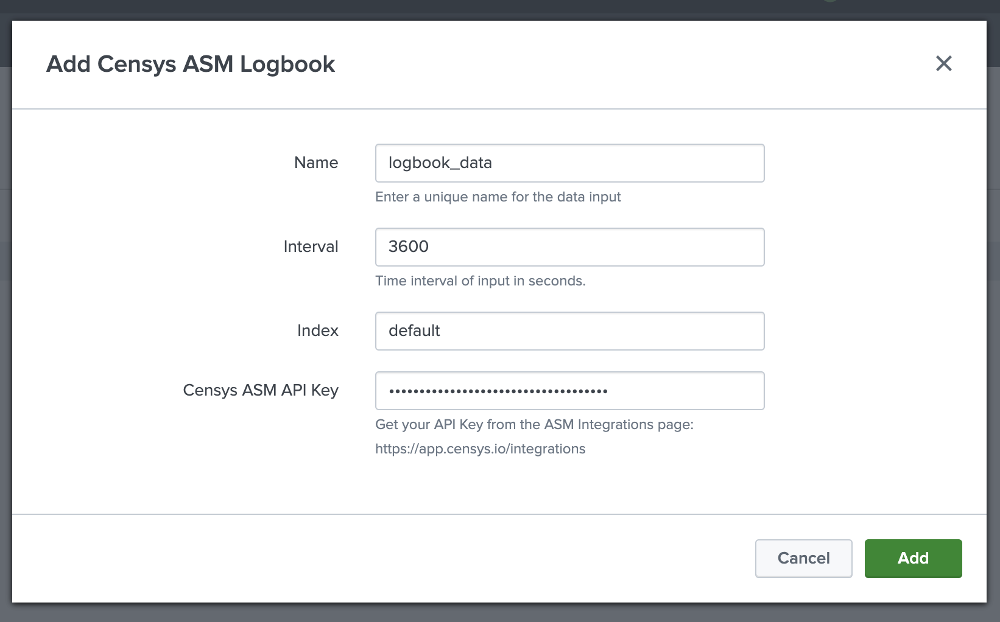

# Censys Add-on for Splunk

The Censys Add-on for Splunk allows Censys ASM users to import Logbook and Risks data into Splunk®, where changes in their attack surface can be easily directed to downstream security and analytics applications.

Data from the logbook is visualized with a pre-built dashboard that can be customized with additional views.

This guide will help you:

- Install the Censys Add-on in your Splunk environment
- Configure the Censys Add-on
- Use the Censys Add-on to monitor your attack surface

Splunkbase: <https://splunkbase.splunk.com/app/6399>

### Ready to start? Here's what you need:
1. Your Censys ASM API key

    Find your key on the Censys ASM [integrations page][censys-asm-integrations].
    

2. A Splunk account and installation.

## Install the Censys Add-on for Splunk

### Local Installation

`git clone git@gitlab.com:censys/integrations/censys-splunk.git`

This method assumes you have Docker and Docker Compose installed and running on
your server.

Run the Docker Compose file

```sh
docker-compose up
```

Open your browser to https://localhost:8000/ and login with your Splunk credentials.

### Install from Splunkbase
Coming soon
## Configure the Add-on
### Logbook

From the Inputs page, select Create New Input. Fill out the following fields:
- Name for your data input
- Censys ASM API key from the Censys ASM [integrations page][censys-asm-integrations]
- Adjust the Interval field if desired. This determines how frequently data will be fetched from Censys ASM.
<!-- TODO say anything about default index? -->



### Risks
Coming soon

## Use the Add-on

Under the Search tab, you can enter queries on your data inputs.
If you are not familiar with Splunk search syntax, Splunk has the following helpful resources:
- [Splunk Search Documentation][splunk-search-documentation]
- [Splunk Search Tutorial][splunk-search-tutorial]

## License

[](http://www.apache.org/licenses/LICENSE-2.0)

<!--
## Binary File Declaration

```plain
./Splunk_TA_censys/bin/splunk_ta_censys/aob_py3/pvectorc.cpython-37m-x86_64-linux-gnu.so: this file does not require any source code
./Splunk_TA_censys/bin/splunk_ta_censys/aob_py3/markupsafe/_speedups.cpython-37m-x86_64-linux-gnu.so: this file does not require any source code
./Splunk_TA_censys/bin/splunk_ta_censys/aob_py3/setuptools/cli.exe: this file does not require any source code
./Splunk_TA_censys/bin/splunk_ta_censys/aob_py3/setuptools/cli-arm64.exe: this file does not require any source code
./Splunk_TA_censys/bin/splunk_ta_censys/aob_py3/setuptools/gui-32.exe: this file does not require any source code
./Splunk_TA_censys/bin/splunk_ta_censys/aob_py3/setuptools/gui-64.exe: this file does not require any source code
./Splunk_TA_censys/bin/splunk_ta_censys/aob_py3/setuptools/cli-64.exe: this file does not require any source code
./Splunk_TA_censys/bin/splunk_ta_censys/aob_py3/setuptools/cli-32.exe: this file does not require any source code
./Splunk_TA_censys/bin/splunk_ta_censys/aob_py3/setuptools/gui.exe: this file does not require any source code
./Splunk_TA_censys/bin/splunk_ta_censys/aob_py3/setuptools/gui-arm64.exe: this file does not require any source code
```
-->

<!-- References -->
[censys-asm-integrations]: https://app.censys.io/integrations
[splunk-search-documentation]: https://docs.splunk.com/Documentation/Splunk/8.2.5/Search/GetstartedwithSearch?ref=hk
[splunk-search-tutorial]: https://docs.splunk.com/Documentation/Splunk/8.2.5/SearchTutorial/WelcometotheSearchTutorial?ref=hk
